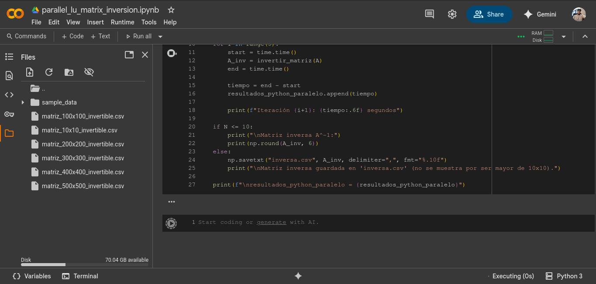

# Código

## Árbol de carpetas

```text
├── cholesky
│   ├── cholesky.c
│   ├── cholesky_paralelo.c
│   ├── cholesky_paralelo.py
│   └── cholesky.py
├── gaussiana
│   ├── gaussiana.c
│   ├── gaussiana.py
│   ├── parallel_gaussiana.c
│   └── parallel_gaussiana.py
├── inversion_manual_impl.ipynb
├── lu
│   ├── lu_matrix_inversion.c
│   ├── lu_matrix_inversion.ipynb
│   ├── parallel_lu_matrix_inversion.c
│   └── parallel_lu_matrix_inversion.ipynb
├── matrix_inversión_cuda.ipynb
└── README.md
```


Como se puede observar en el árbol de carpetas del repositorio el código principal está dividido en las carpetas de los algoritmos realizados. Por ejemplo, en la carpeta `lu` se encuentran alojados 4 archivos. La inversión de matrices de manera secuencial con el lenguaje C, la inversión de matrices de manera secuencial con el lenguaje Python, y otros 2 archivos con la implementación paralelizada del algoritmo. 
Aparte de esto, se encuentra también un notebook de Google Colab llamado `matrix_inversión_cuda.ipynb` en el cual se encuentra la implementación de los 3 algoritmos usando CUDA. 

## Compilación y ejecución

### Python
Para los algoritmos de Python (todos implementados en notebook de Google Colab) solo se requiere ejecutar el notebook con las matrices cargadas en el espacio de trabajo en la carpeta raíz del entorno de trabajo. 



Las matrices a usar se encuentran todas en este repositorio también en la carpeta proyectos_2025-1/virtual/GR-06/matrices

Se pueden cargar estas matrices en formato `.csv` o generar nuevas matrices de diferentes tamaños para probar la eficiencia de los algoritmos. 

**Restricciones para la generación de matrices:**
- Para los algoritmos `lu` y `gaussiana` las matrices que se deben usar deben cumplir con ser cuadradas e invertibles.
- Para el algoritmo `cholesky` se deben tener en cuenta las recomendaciones anteriores y adicionalmente, deben ser definidas positivas. (estas matrices también están cargadas en el repositorio en la carpeta proyectos_2025-1/virtual/GR-06/matrices/def_pos_inv)

